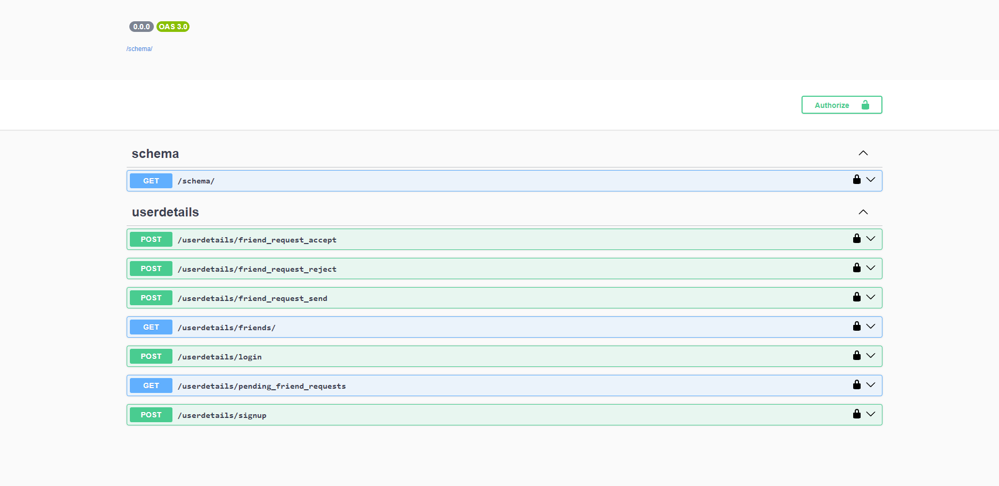
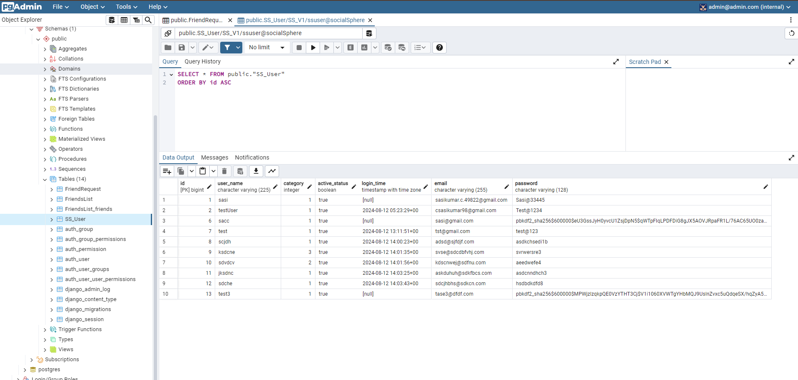
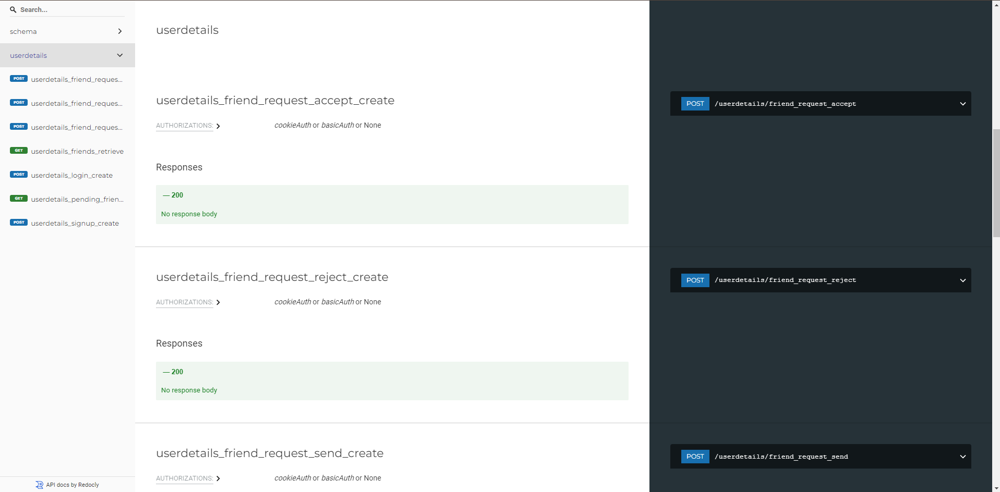

## socialsphere

# 1.Run docker:
    To run all services:
                --docker compose up -d --build 
    To run particular services:
                --docker compose up -d --build <service-name>

# 2.Run Django:
    To migrate models:
                --python manage.py makemigration
                --python manage.py migrate
    To Start django in dev version:
                --python manage.py runserver 0.0.0.0:8000
    
# 3.Api calls:
    With postman:
                -- Added postman collection in following path('apps/django/socialsphere.postman_collection.json')
    With swagger-ui:
                --Created swagger ui to test apis on ui use following link('http://127.0.0.1:7000/schema/swagger-ui/)
#### swagger-api-test

    
# 4.Api Docs:
    With Swagger:
                -- Use following link to see documentation for all APIs('http://127.0.0.1:7000/schema/redoc/')

# 5.To access Db:
    Pgadmin:
                -- Connect postgress server with pgadmin to access database in UI
                -- credential for pgadmin 
                            user name = admin@admin.com
                            password  = admin
                -- credential for postgress
                            user name = ssuser
                            password  = Admin@123

#### swagger-docs

## Tools Used
 

 

 

 

 

